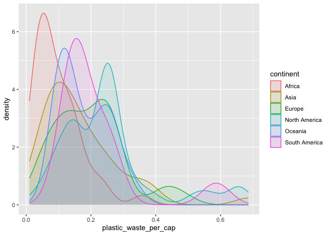
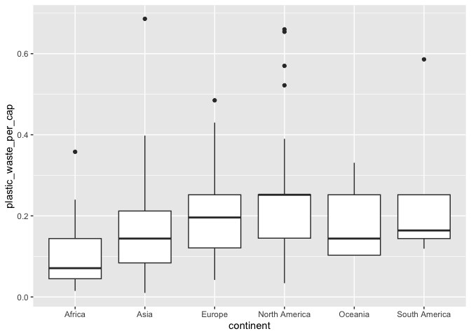
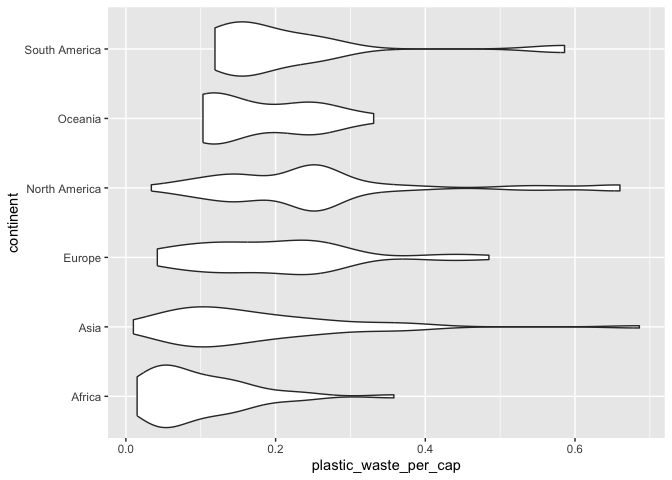
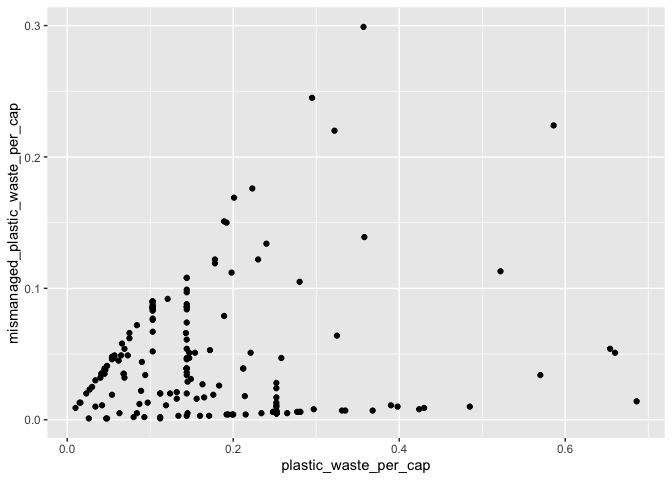
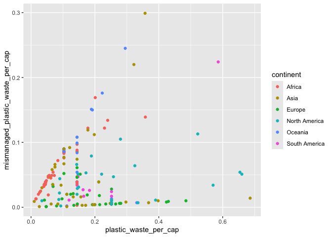
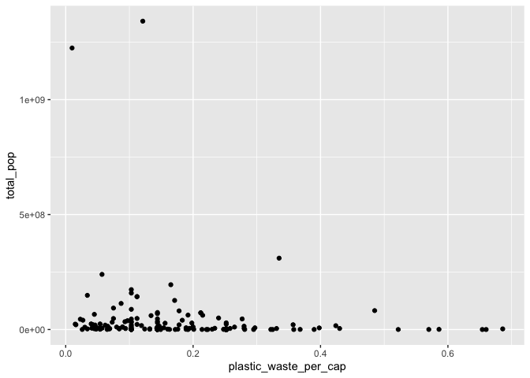

Lab 02 - Plastic waste
================
Rachel Weiner
January 22, 2026

## Load packages and data

``` r
library(tidyverse) 
```

``` r
plastic_waste <- read.csv("data/plastic-waste.csv")
```

## Exercises

### Exercise 1

Histograms of plastic waste per capita, faceted by continent:

``` r
ggplot(data = plastic_waste, aes(x = plastic_waste_per_cap)) +
  geom_histogram(binwidth = .2) + 
  facet_wrap(~ continent)
```

    ## Warning: Removed 51 rows containing non-finite outside the scale range
    ## (`stat_bin()`).

<!-- -->

The six histograms above help us to visualize plastic waste per capita
across the six respective continents. It seems that Oceania and South
America has the lowest plastic waste per capita compared to the other
continents while Africa, Asia, Europe, and North American seem to have
greater plastic waste per capita.

### Exercise 2

Density curves!

``` r
ggplot(
  data = plastic_waste,
  mapping = aes(
    x = plastic_waste_per_cap,
    color = continent,
    fill = continent
  )
) +
  geom_density(alpha = 0.1)
```

    ## Warning: Removed 51 rows containing non-finite outside the scale range
    ## (`stat_density()`).

<!-- -->

This density curve allows us to visualize plastic waste per capita in a
color-coded format. As far as the code goes, we define color and fill
within the mapping aesthetics as this helps tell r which variables we
want to display from the larger data set. On the other hand, we define
the aplha level within the plotting geom as this does not pertain to the
data itself but instead to the formatting of the plot, separate from any
data implications.

### Exercise 3

Box plots!

``` r
 ggplot(
  data = plastic_waste,
  mapping = aes(
    x = continent,
    y = plastic_waste_per_cap
  )
) +
  geom_boxplot()
```

    ## Warning: Removed 51 rows containing non-finite outside the scale range
    ## (`stat_boxplot()`).

<!-- --> This is a
side-by-side box plot. It is quite difficult to read, lets try something
else.

``` r
ggplot(plastic_waste, aes(x = plastic_waste_per_cap, y = continent)) +
  geom_violin()
```

    ## Warning: Removed 51 rows containing non-finite outside the scale range
    ## (`stat_ydensity()`).

<!-- -->

This is a violin plot, it is another way to visualize data. It is very
helpful in visualizing outliers specifically, as seen in North America.
I think the different shapes are a cool way to visualize data.

### Exercise 4

Let’s try a scatterplot.

``` r
ggplot(plastic_waste, aes(x = plastic_waste_per_cap, y = mismanaged_plastic_waste_per_cap)) +
  geom_point()
```

    ## Warning: Removed 51 rows containing missing values or values outside the scale range
    ## (`geom_point()`).

<!-- -->

This scatterplot plots the relationship between plastic waste per capita
by mismanaged waste per capita. The relationship between these two
variables appears to be a moderate positive association as plastic waste
per capita increases, mismanaged waste per capita increases as well.
This makes sense as a country with more plastic waste would have more
plastic waste to mismanage.

``` r
ggplot(plastic_waste, aes(x = plastic_waste_per_cap, y = mismanaged_plastic_waste_per_cap, color = continent)) +
  geom_point()
```

    ## Warning: Removed 51 rows containing missing values or values outside the scale range
    ## (`geom_point()`).

<!-- -->
Now that we have colored each point to it’s respective continent, we are
able to more clearly visualize associations between the relationship
between plastic waste per capita and mismanaged waste per capita in
relation to specific continents. Though it is not super clear, we are
able to see trends and patterns.

Here are two scatterplots plotting plastic waste per capita by total
population and then by coastal population.

``` r
ggplot(plastic_waste, aes(x = plastic_waste_per_cap, y = total_pop)) +
  geom_point()
```

    ## Warning: Removed 61 rows containing missing values or values outside the scale range
    ## (`geom_point()`).

<!-- -->

This scatterplot plots plastic waste per capita by total population,
demonstrating a weak association.

``` r
ggplot(plastic_waste, aes(x = plastic_waste_per_cap, y = coastal_pop)) +
  geom_point()
```

    ## Warning: Removed 51 rows containing missing values or values outside the scale range
    ## (`geom_point()`).

<!-- --> This
scatterplot plots plastic waste per capita by coastal population,
demonstrating a slightly stronger association.

### Exercise 5

Remove this text, and add your answer for Exercise 5 here.

``` r
# insert code here
```
